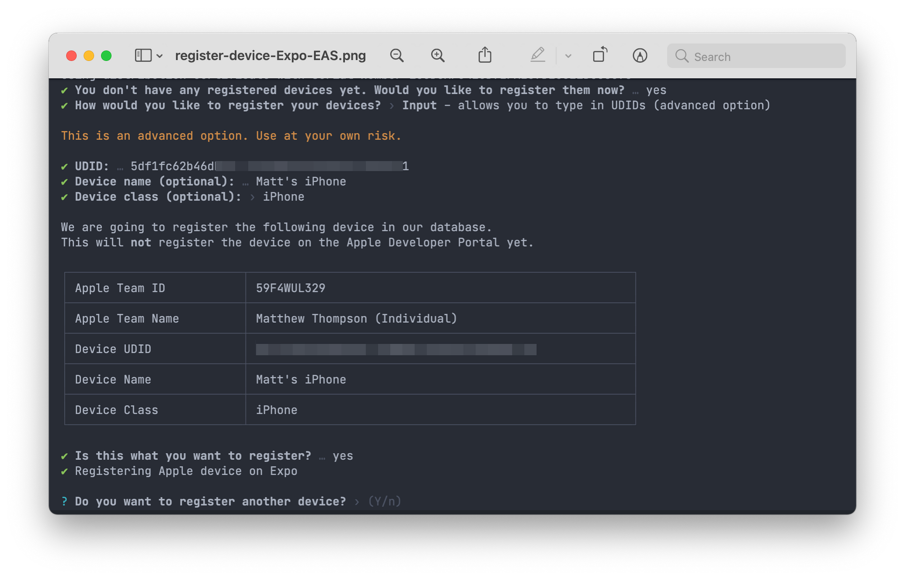
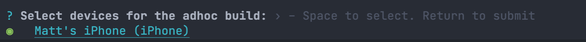
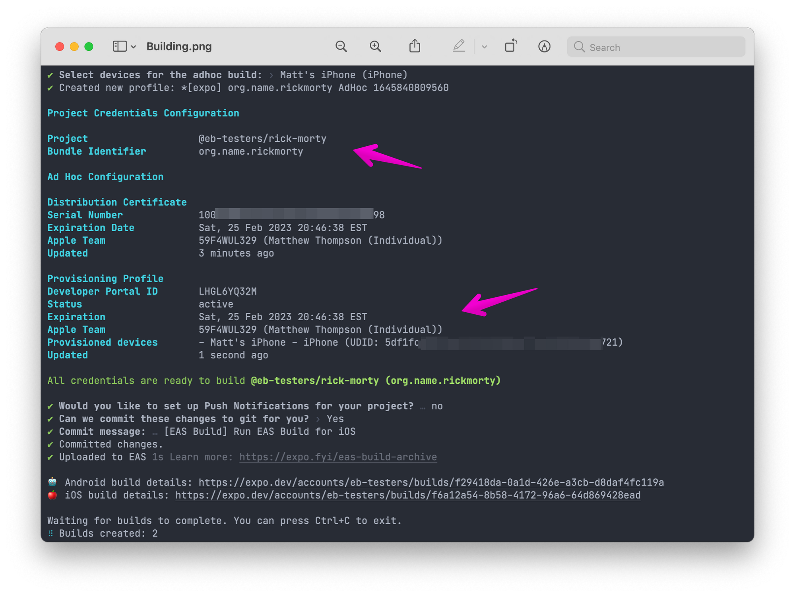
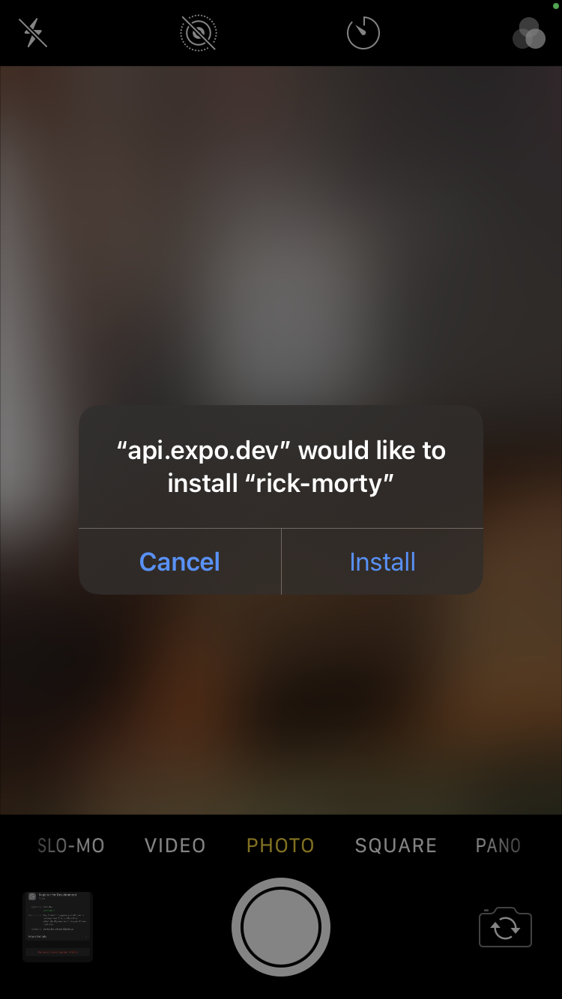
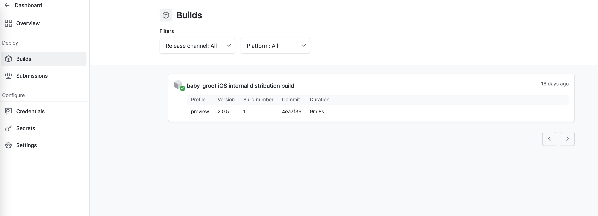
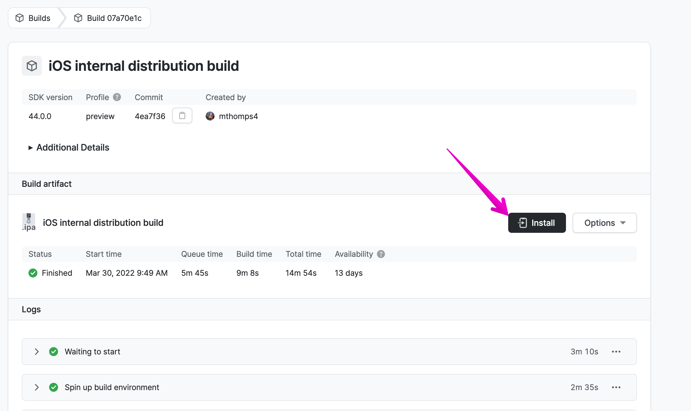
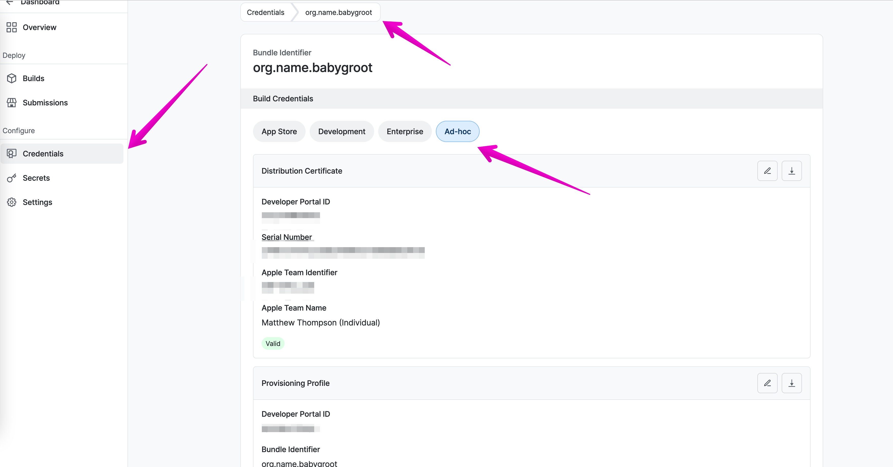
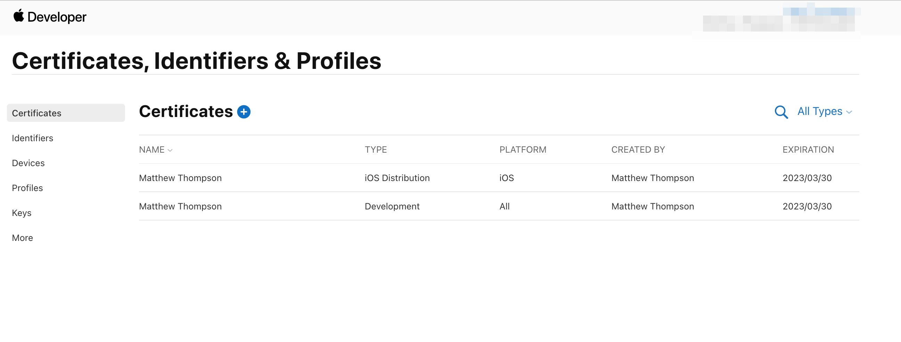

# TOC

- [TOC](#toc)
  - [Your first build w/ EAS](#your-first-build-w-eas)
  - [10,000 ft View](#10000-ft-view)
  - [Building Our First Build](#building-our-first-build)
    - [EAS Config](#eas-config)
    - [First Build Run](#first-build-run)
      - [Setting up a Device](#setting-up-a-device)
      - [Setup Push Notifications](#setup-push-notifications)
      - [SUCCESS](#success)
  - [Ok... So what all happened there](#ok-so-what-all-happened-there)
    - [Expo Dashboard](#expo-dashboard)
      - [Builds](#builds)
      - [Credentials](#credentials)
    - [Android Credentials](#android-credentials)
  - [But Wait... What about Dev, Alpha, Production?!?](#but-wait-what-about-dev-alpha-production)

## Your first build w/ EAS

So we have "Hello World" running. Great!

The reality, our work means little if we can't "ship it".

So before we go crazy trying to add the coolest features into our mobile app, we need to understand how the mobile world works when it comes to building, testing, and App Submission.

If you are coming over from Web now is the time to go grab a snack, and fresh drink (or two). We're need to cover a lot of terms and process.

## 10,000 ft View

There are two major players in the mobile space world. Apple and Android. There are technically others (Windows, Linux, etc), and yes React Native _can_ support them, but its rare we need them.

So for this guide we are going to chat through how to `submit` with EAS to both Expo TestFlight (iOS) and Google Play (Android).

... But before we even make it to the stores, we need a `build` of our app.

## Building Our First Build

Before we even mess with the app stores, we want to create a solid way to verify our app works as expected. Insert Expo.

There are two types of "builds" that Expo can manage for us. "internal" and "store".

As you would expect it. `store` is meant to get our app ready for the AppStores.
To start we need to make an `internal` build in Expo.

- Ensure expo-cli and eas-cli are installed from the previous steps.
- Ensure you are logged into eas w/ `eas whoami`
- From our "hello world" app run `eas build:configure` - this will output `eas.json` and update our `app.json` file.

------

### EAS Config

[eas config](https://docs.expo.dev/build/eas-json/)
[eas schema](https://docs.expo.dev/build-reference/eas-json/)

The build:configure will spit out an example `development`, `preview`, and `production` block.
We'll be expanding these quite a bit, but first lets see if we can get a build rolling.

### First Build Run

Lets run `eas build --profile preview`
If you take a close look, you'll see `preview` is marked `distribution: internal`.
This means it will not push to the AppStore and is only meant to be built and installed through Expo.

You should get a prompt for `select platform`.
Select `iOS` to start.

From here, you'll be prompted "Do you want to use your apple dev account?"
**YES PLEASE** -- Expo will manage all your Certs, Profiles, etc.
This is one of the main benefits of Expo... trust me - you don't want to do this manually.

What are all these things?!
More on that later... for now just know there's a lot of "stuff" the AppStore needs to verify you, your app, and get it ready to ship. Each store has their own set of "stuff" that needs managed.

#### Setting up a Device

During the process you'll be prompted to set up or choose a list of Devices that should be able to download and test your app. (iOS) Each device has a uniq UUID attached. Follow the prompts and add your physical device.

[Setting up Expo Profile](./setting-up-expo-profile.md)

**On the next build**

#### Setup Push Notifications

When Expo asks if you would like to enable Push Notifications go ahead and select Yes. For iOS We'll need to add `capabilities` via XCode later to have this fully functioning, but this adds the key to the AppStore. For Android, we'll need to provision Firebase through Google's console (Assuming no 3rd party lib)

#### SUCCESS

Hopefully you'll see your build in Queue.
once complete you should see a URL and QR code to scan.

Assuming everything is successful from setting up your device you should see this prompt.

## Ok... So what all happened there

### Expo Dashboard

Lets navigate to the Expo Dashboard `expo.dev`.
Navigate to your app and you'll see in the sidebar `builds` and `credentials`.
Lets start with build.

#### Builds

If you open the `builds` tab you'll see your successful build like below.

In the event your build failed, you can click through here to see the logs and error messages as to why it failed. Assuming it was a success, you should be able to click through and see something similar below. Here you can see the build logs, additional info, and even locate the QR/URL again for install.

#### Credentials

Lets navigate to Credentials and select `iOS`.

Here you should see a `Bundle Identifier` for `org.name.{MyApp}`. Lets click on that.
You should be brought to a screen like below:

Taking a closer look, you'll notice Expo has created an AdHoc `Developer Certificate` for us, a `provisioning profile (bundle identifier)`, and you'll see the key that was generated for `push notifications`

**The benifit of Expo:** If you sign into `developer.apple.com` navigate to `Certificates, Identifiers, & Profiles`. Navigating through you can see all these have been provisioned through apple and synced with Expo :tada:!

### Android Credentials

We'll need to add credentials a slightly different way w/ Expo. More on that soon, we'll want to add our Flavor variants first.

[(see Android Credentials)](04-android-adding-flavors.md#android-credentials)

## But Wait... What about Dev, Alpha, Production?!?

You're right... we are just getting started.
If you look at the profile from our preview build in expo or the AppStore you'll notice it used `org.name.MyApp` that's actually the profile we'd want for our PRODUCTION app.

Lets fix that!

[Adding Build Variants](./03-adding-build-variants.md)
