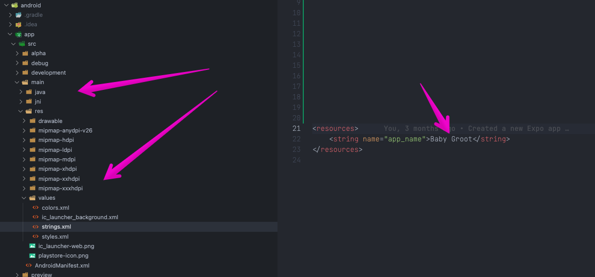
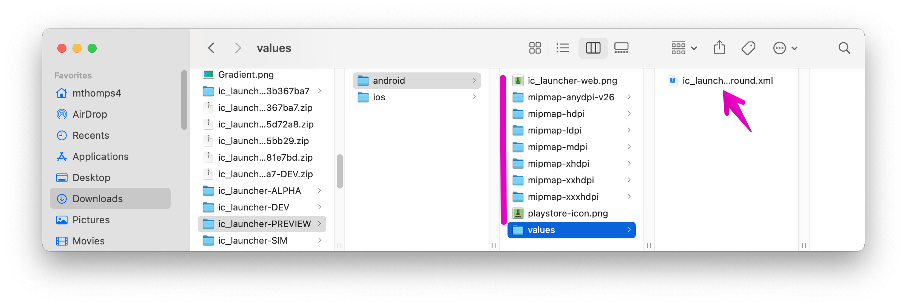
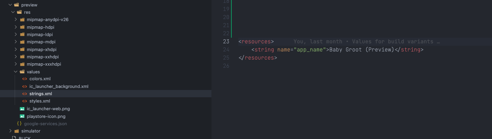

# Android Flavors

We'll be following Expos docs pretty 1:1 here. I'll try to point out a couple of "Gotcha's" along the way.

[bare-workflow android variants](https://docs.expo.dev/build-reference/variants/#android)

## Adding Flavors

Open up the `android/app/build.gradle` file and scroll down until you see `android`.

Toward the bottom of this object, before `applicationVariants.all` add the recommended block of code for our new flavors and expand to fit our example. (see below)

`flavorDimensions` will create a namespace for our flavors to live under.
`productFlavors` is where we will define all of our flavors/variants.

> Note: Currently, EAS CLI supports only the applicationId field. If you use applicationIdSuffix inside productFlavors or buildTypes sections then this value will not be detected correctly.

```groovy
  flavorDimensions "env"
  productFlavors {
      simulator {
          dimension "env"
          applicationId "com.babygroot.simulator"
      }
      development {
          dimension "env"
          applicationId "com.babygroot.development"
      }
      preview {
          dimension "env"
          applicationId "com.babygroot.preview"
      }
      alpha {
          dimension "env"
          applicationId "com.babygroot.alpha"
      }
      production {
          dimension "env"
          applicationId "com.babygroot"
      }
  }
```

**Optional:(skip)** By default, every flavor can be built in either debug or release mode. If you want to restrict some flavor to a specific mode, see the snippet below, and modify build.gradle.

```groovy
    // Limit Type of Releases per Flavor
    variantFilter { variant ->
        def validVariants = [
            ["production", "release"],
            ["alpha", "release"],
            ["preview", "release"],
            ["development", "debug"],
            ["simulator", "debug"],
        ]
        def buildTypeName = variant.buildType*.name
        def flavorName = variant.flavors*.name

        def isValid = validVariants.any { flavorName.contains(it[0]) && buildTypeName.contains(it[1]) }
        if (!isValid) {
            setIgnore(true)
        }
    }
```

## Android file structure

So we've created our flavors, but how do we define the App name, the Icon, what if flavors need different google service keys?!

Let's dive in...

If you open up `android/app/src` you'll see two folders `main` and `debug` our goal is to create a new folder here PER flavor we are hoping to build. Within these folders we'll mimic `main/res` with our new AppIcons and `values` folder containing a `strings.xml` file. Here we can update the App Name that will display. While you can update the other files in values, we can simply copy those from `main` as there's no need to change.



### How to create all these Icons

Android Studio does have an Image Studio to leverage, however -- Android Studio itself can sometimes be a pain and this option isn't always available if your app is struggling to build.

I personally stumbled upon [easy app icon](https://easyappicon.com/) and found it to generate all I need for both platforms.

**Pro Tip**: AppIcons at their largest recommend are 1024x1024. To help with this, I created a quick template in Canva to generate AppIcon pngs.


Upload the Icon, it should recognize and generate a Background Color for you, leave the export name as is. You can toggle the Zoom and note the Icons on the left to see how it will look with rounded corers, where words may chop off etc.

Once you are happy export!


Unzip the download and you should see all your files for both ios and android. We'll want to copy what is in the Android folder over to our new Profile folder. Create a `preview` folder under `src` next to `main`.

Copy the folders from our download over, and copy the value file given to the values folder.



Example of Preview folder.


Rinse and repeat for all the Flavors we are creating. (Sim, Dev, Alpha) NOTE: Production in this case will be `main` copy the new app Icons there.

## EAS Base Config

The last thing we want to update is the build section of our `eas.json`. Our original build:configure line created a `preview` profile for us, but there's some extra work to get this set.

If you have already set up iOS, you'll only need to focus on the android specifics here.

We'll want to create a "Base" profile that we can `extend` into our other profiles. This tells Expo which specific versions we care about when building our app. `npm`, `yarn`, `pods`, `expo sdk`, etc.

Next, we'll want to update our build profiles to use the newly created `base` and add a few android specifics to each profile. Namely: `gradleCommand` and `buildType`

```json
 "build": {
    "base": {
      "node": "16.13.1",
      "yarn": "1.22.10",
      "android": {
        "image": "latest"
      },
      "ios": {
        "image": "latest",
        "cocoapods": "1.11.2"
      }
    },
    "simulator": {
      "extends": "base",
      "distribution": "internal",
      "channel": "simulator",
      "developmentClient": true,
      "env": {
        "APP_ENV": "simulator",
        "debug": "true"
      },
      // ...ios
      "android": {
        "gradleCommand": ":app:assembleSimulatorDebug",
        "buildType": "apk"
      },
    },
    "development": {
      "extends": "base",
      "distribution": "internal",
      "channel": "development",
      "developmentClient": true,
      "env": {
        "APP_ENV": "development",
        "debug": "true"
      },
      // ...ios
      "android": {
        "gradleCommand": ":app:assembleDevelopmentDebug",
        "buildType": "apk"
      },
    },
    "preview": {
      "extends": "base",
      "channel": "preview",
      "distribution": "internal",
      "env": {
        "APP_ENV": "preview"
      },
      // ...ios
      "android": {
        "gradleCommand": ":app:assemblePreviewRelease",
        "buildType": "apk"
      }
    },
    "alpha": {
      "extends": "base",
      "channel": "alpha",
      "env": {
        "APP_ENV": "alpha"
      },
      // ...ios
      "android": {
        "gradleCommand": ":app:bundleAlphaRelease"
      }
    },
    "production": {
      "channel": "production",
      "env": {
        "APP_ENV": "production"
      },
      // ...ios
      "android": {
        "gradleCommand": ":app:bundleProductionRelease"
      }
    }
  },


```

Above, is the full android eas needed for our example here.

The big gotcha is to note how the gradleCommands change based on our new Flavors. Instead of `:app:bundleRelease` or `:app:assembleDebug` we now have an extra namespace to note. e.g. `:app:bundleAlphaRelease`

It's also worth noting we can use both `bundle` and `assemble` in our commands. `bundle` will bundle for the Google Play store and produce an `aab` file.

For our Expo Flavors (Sim, Dev, Preview) we want to create an `apk` file that can be manually downloaded to our device via Expo QR. To do this for Dev we use the `assembleDevelopmentDebug` command, and the `buildType` command. This will create a `DEBUG` build with an `apk`.

For `Preview`, we actually want a `Release` build. While you would think to use `bundle` here, that doesn't work for Expo and needing an apk. We still use the `assemble` command, but tell it to assemble a Release. `assemblePreviewRelease` with an `apk` buildType.

Recalling our goal this will produce.

Sim: Will zip a file to your machine with an APK to drag n drop to your emulator

Dev: Expo will produce a QR code where you can Download the app on your device. (Requires dev client)

Preview: Expo will produce a QR code with the Release build to download on your device.

Alpha/Prod: Expo will produce a build ready to submit to the Play Store for release.

## Android Credentials

Up until now we haven't built for android or talked about the PlayStore. Lets do that now.

[Android Creds](./android-accounts-and-expo-credentials.md)

## Our Second Build

We'll need to make one more change for Expo before our next build. Lets head over and update our `app.json`. [app-config](05-app-config.md)
