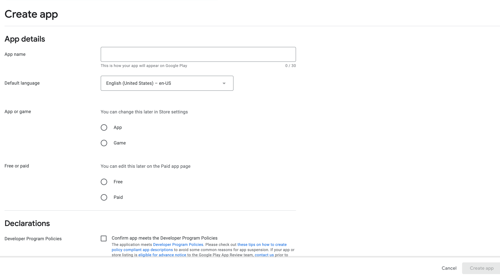
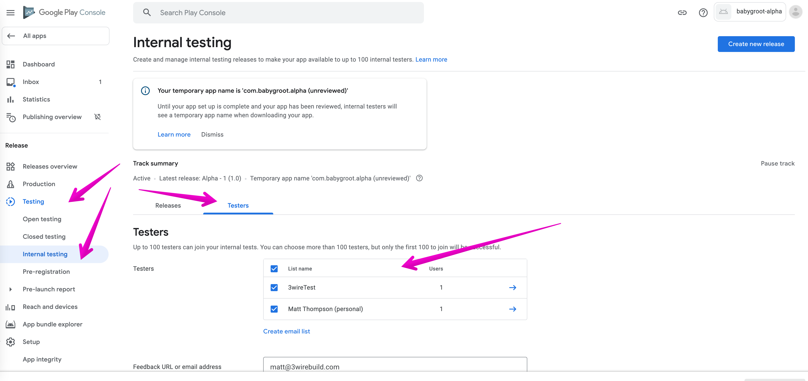
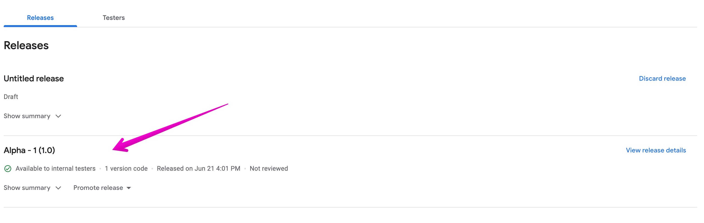
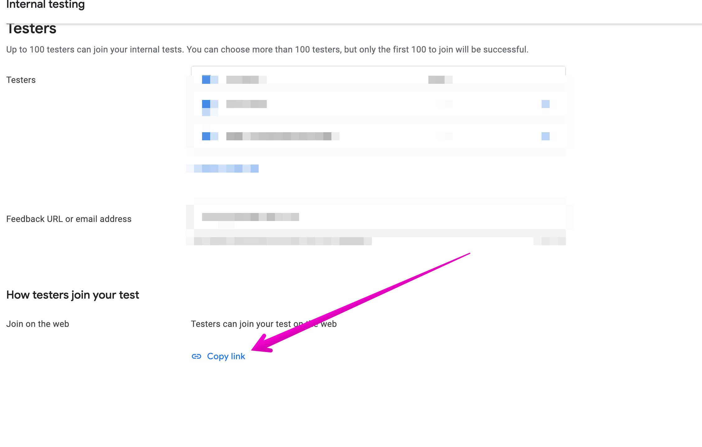
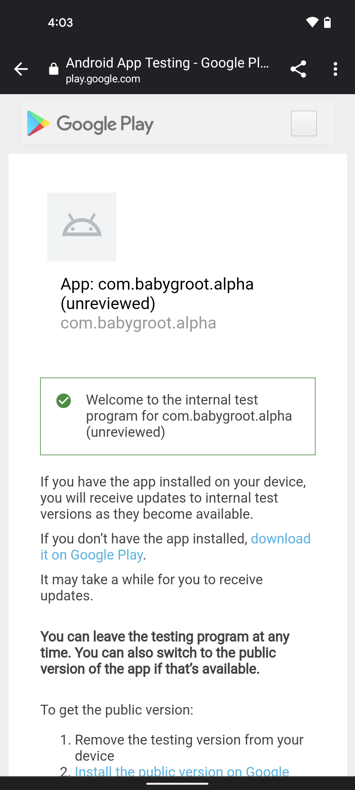
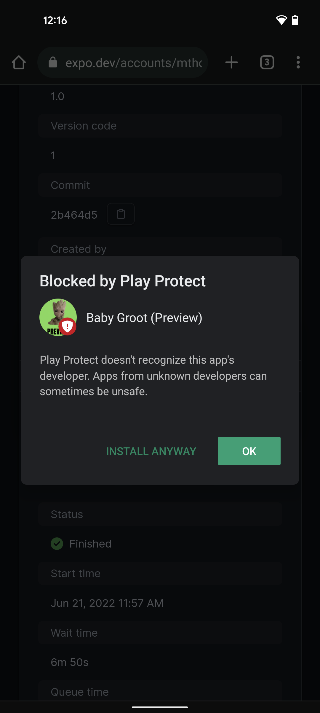
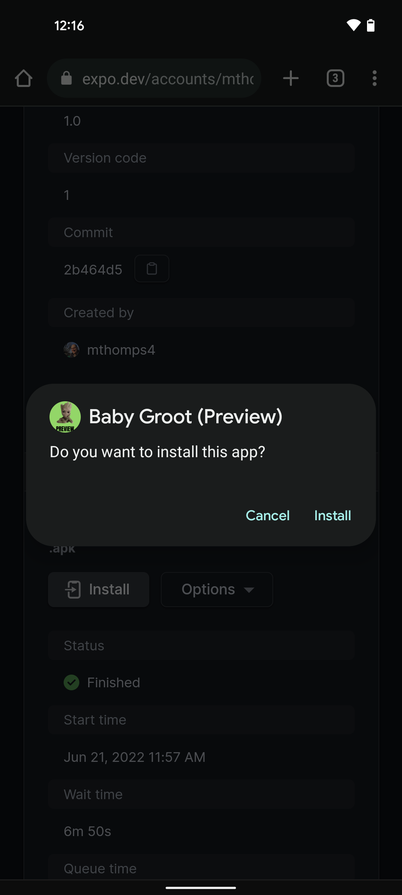
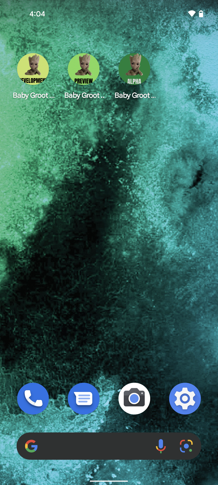

# To Google Play

Alright... So we have stuff working through Expo.
Great, that's a huge accomplishment, but we still need to get these to the AppStore.

Its finally time.

Lets build our first `Alpha` Build for a store release.

## Versioning

We've mentioned a few times we'll handle versioning A LOT differently in CI/CD. For now, lets bump these builds manually to get things rolling.

Open `app/build.gradle` and spot the `android` section again.
You should see `defaultConfig` with `versionCode` and `versionName`.

These should be set to 1 and 1.0.

Android needs these to increment each release and version bump as we cut a full release go.

Example: You would see `1.0 (1)` -> `1.0 (2)` -> `1.1 (1)` -> and so on...

To start we should be fine, if we need to cut `Alpha` again, bump the `versionCode` up by 1.

## Build and "Submit"

- `eas build -p android --profile alpha`

Wait for this build to finish and navigate to the Expo Dashboard.

Under our project > Builds, you should see your Android `Alpha` build ready to go. Click on that and click download. You should get an `aab` file this time.

*Remember, for the store we need an `aab` not `apk`.

We can't run `eas submit` just yet. For the FIRST time, we have to cut this release manually. Lets head over to the store.

## The Store

From the main dashboard, click `Create App`
The App Name should match the App name of your Flavor. The same name you entered in `src/alpha/res/values/strings.xml`

In my case this was `BabyGroot (Alpha)`

Select: `app` and `free` (assuming that's true and create)

Navigating back to the main Dashboard, you should see your new app on the home screen.

Click on that!

### Test Groups

Before we cut a release, we'll want to create a Test Group for this release.

Google Play has quite a few Testing Groups to help you run the course from Idea to Production. For the most part, we use `Internal Testing Groups` until we are ready to launch. But there are quite a few of Beta, Closed Testings options as well should you need.

Click on Internal Testing and `Testers` -- Remember those Users we added earlier -- You can create an email list here with those folks, plus anyone else you may want to test the app (Stakeholders, other engineers, etc).

### Cut the Release

YAY!

Click on `Releases tab` next to Testers.
And click `Create New Release` at the top.

Upload that `aab` file here.
Enter any Notes you'd like for folks to see and `Review Release`

Assuming everything looks good, Let it rip!
You should see something like below.

### Invite Users

Unlike TestFlight folks won't be emailed the link automagically to install your Release.

Click the `testers` tab again and you should see a `copy link` button now.
Use this to email/SMS folks to install.

### USER TESTING

Upon receiving the link, you'll be asked a few "Are you sure?!" questions. Google has yet to make sure you are not scum and has no clue if you're app is safe yet... At this point, we assume everyone knows everyone and we click "Yes please!" to skip and install.

**Welcome Link:**

**Install Screens:**

**APPS:**

## Congrats

You have an app ready in the AppStore. Now lets take one final look at how we can Debug these builds should anything go wrong.

[Creating the Development Build](./09-creating-the-development-build.md)
