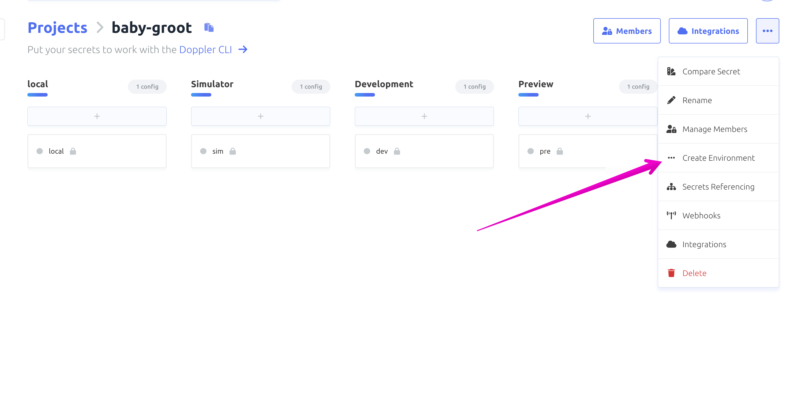
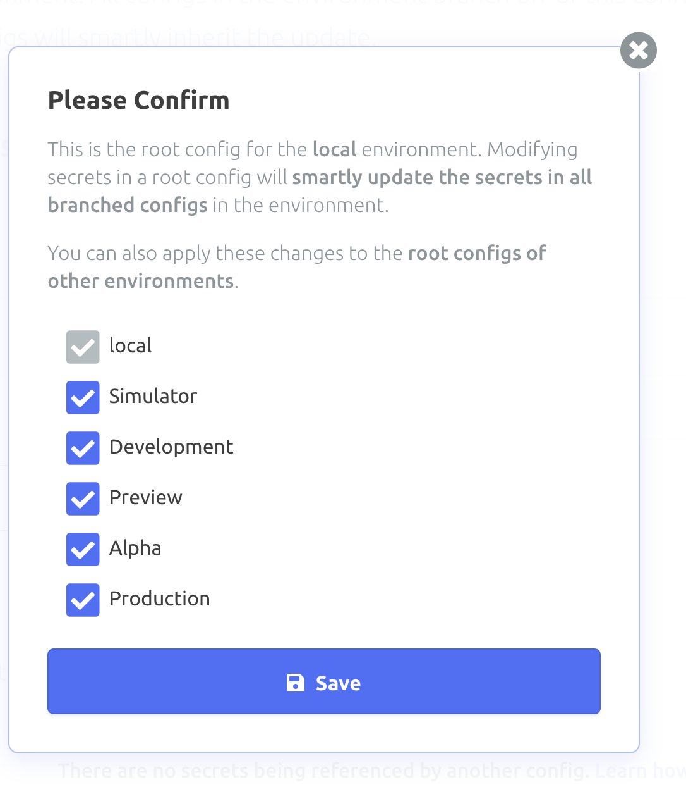
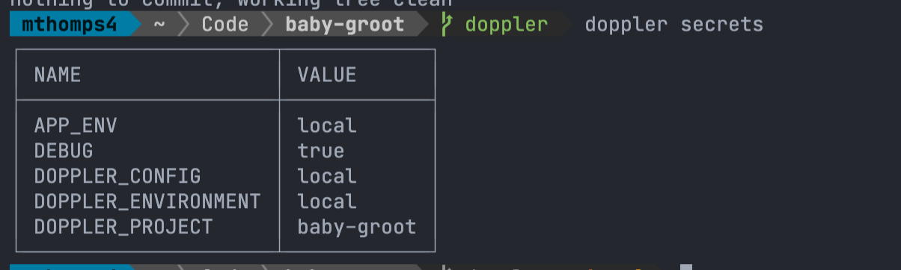

# Adding ENVs to Expo w/ Doppler

## Local Dev

From our last example we started refactoring our yarn start scripts.
They work... but it could be so much better.

Lets create a doppler account and use it to simplify things.

Head over to [doppler.com](https://doppler.com) and create a free account.

### Doppler Projects

Once you've created an account, lets create a new Project for our app.
By default, a doppler project starts with `Development, Staging, Prod` environments.

To fit our example, lets rename `staging` to `preview`.
Then create new environments for `alpha`, `simulator`, and `local`.

> Note: local, dev, and simulator are probably all the same... you _could_ use dev or sim locally, but we'll want to match the profile names for CI/CD later on.



Next, lets add some ENVs to the apps.
Open up `local` environment and add `APP_ENV` with `local` and `DEBUG` as `false` and hit save.
When asked.

Select ALL the envirionments and hit save.
This will map the ENVs to each.

Then click through each environment and change `APP_ENV` to match the environment/profile.



### Doppler Cli

[install doppler](https://docs.doppler.com/docs/install-cli)

Next, lets install the CLI.
This will allow us to use doppler commands in our yarn scripts.

For Mac:

```sh
brew install gnupg
brew install dopplerhq/cli/doppler

doppler --version
doppler login
```

Once logged in, we are good to start setting up our doppler with our App.

### Local Doppler

Navigate to the root of your app and create a file called `doppler.yaml` with the following:

```yaml
setup:
  project: your-project-name
  config: local
```

- run `doppler setup`

To confirm everything works, run `doppler secrets`
You should see something like the following.



### yarn scripts

Now we are all set to use doppler for our start commands.
We can [inject](https://docs.doppler.com/docs/accessing-secrets#injection) these ENVs with `doppler run -- your-command-here`

We can simplify our previous yarn commands with the following.

```json
{
  "start": "doppler run -- expo start --dev-client --scheme babygroot-development",
  "android": "doppler run -- expo run:android --variant=DevelopmentDebug",
  "ios": "doppler run -- expo run:ios --scheme babygroot-development",
  "web": "doppler run -- expo start --web",
  //...
 }
```

**Note:** We still need to keep the `scheme` and `variant` flags so that the start commands know which target/flavor to build.

### Swapping Environments Locally

I really need to connect to staging locally?!

No worries, Doppler has us covered.

Update the `doppler.yaml` file to the environment in need.

```yaml
setup:
  project: baby-groot
  config: preview # <-- CHANGE THIS
```

Re-Run `doppler setup` and verify with `doppler secrets`
You should be all set!!

**!!WARNING!!:** Make sure to change this back after debugging. With great ENV power comes great production responsibility.

## Expo Constants

- [Expo Constants](https://docs.expo.dev/versions/latest/sdk/constants/)

Expo Constants allows us to view the manifest in our app. Including the `extra` object that we've added via `app.config.js` where all of our ENVs are stored.

We can access these in our app by importing and diving in.

```ts
import Constants from "expo-constants";

const envs = Constants.manifest?.extra;
```

The manifest also hold all the platform and build information about our app should we need to surface.

To make this better, we can make a quick Util function in our app so that we aren't typing `manifest?.extra` everywhere. (thanks Kishan)

```ts
// constants.ts
import Constants from 'expo-constants';

const constants = Constants.manifest?.extra || {}

export const myEnv = constants.MY_ENV || "default";
export const otherEnv = constants.OTHER_ENV || "default";
```

```ts
// MyCoolComponent.ts
import {myEnv} from '@constants'
```

## Local EAS Build w/ Doppler

What about building with EAS?

So lets be real... if we get CI/CD setup -- we shouldn't have a need for running `eas build|submit` locally.

But what if?? does it work?

Nope, it doesn't (wouldn't that be great).
The fact is that EAS build points to our `eas.json` file.
Any secrets would be pulled from that file or Secrets hard coded in Expo's dashboard. [variables and secrets](https://docs.expo.dev/build-reference/variables/)

This means that to use Doppler, we need to `write` the `eas.json` when building. While we could make a script that does all that... It drives us to getting CI/CD running.

## Last step

Finally, as I mentioned we don't want to manage all the Build ENVs every go -- and there's still Versioning to think about. Lets look at what a full CI/CD would look like with GitHub Actions.

[CI/CD and Versioning](./11-ci-cd-setup.md)
