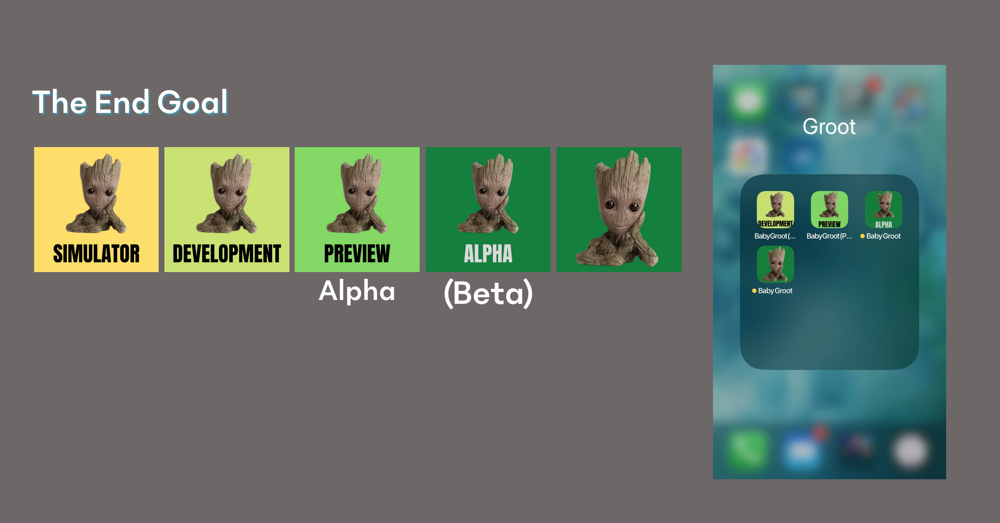

# TOC

- [TOC](#toc)
  - [Adding Build Variants and Profiles](#adding-build-variants-and-profiles)
  - [Goal](#goal)
    - [Build Use Cases](#build-use-cases)
  - [Quick Glossary](#quick-glossary)
  - [Versioning](#versioning)
    - [Android Versioning](#android-versioning)
      - [iOS Versioning](#ios-versioning)
  - [EAS CONFIG -- Proper build variants](#eas-config----proper-build-variants)
  - [Start w/ iOS](#start-w-ios)
  - [Start w/ Android](#start-w-android)

## Adding Build Variants and Profiles

Alright, so we have this first build successfully building through Expo.
We saw that Expo provisioned all the certs and profiles for us with our Apple Dev creds.
AND We were able to download our internal build through Expo's QR Code.

Congrats! That's A HUGE success on its own.
Go grab another snack and fresh cup of coffee, lets buckle in for Round 2.

## Goal

Lets revisit the goals of this dummy repo, we want to create multiple installable environments for our app for ALL stages of development.

Create a BARE Expo application and leverage EAS with the following "variants" that can be installed on a SINGLE device.[See App Variants](https://docs.expo.dev/build-reference/variants/)

- *Simulator
- Development
- Preview
- Alpha
- Production

### Build Use Cases

**Simulator:** This build outputs a `.app` and `.apk` file for your local simulator. You can drag and drop these builds to your running simulator.

**Development:** Builds a DEBUG build via Expo. This is installed via Expo QR Code/URL via Expo profile. We do not worry about bumping the build/version for this build, this is simply for testing/debugging a specific build.

**Preview:** A RELEASE build via Expo. We would look to have CI build this each PR as a sanity check. If we wish to test the build of that PR, we are able to download vis Expo QR/URL.

**Alpha:** TestFlight/Alpha submission. This is the first pass at getting the app to the app store. From here, we can create test groups for both Internal folk and External clients/stakeholders. This build will never actually be release, but is an easy way to run new features by our clients. If you are coming over from Web, this is our "Staging/QA" sandbox. You can imagine this may point to a different dataset, etc. We only need to bump the buildNumber/versionCode here. **Points to Staging Data

**Production:** TestFlight/Prod track submission. The real deal, we can still create test groups for Sanity checks before submitting. This would point to production data and APIs. We would Tag and bump the versions appropriately, test, and submit. ** Points to PROD DATA

*NOTE: Both Simulator and Development builds require `expo-dev-client`. More about Expo Dev Client here [docs/expo-dev-client-setup](./docs/expo-dev-client-setup.md)*

*Alpha/Production Note:* Due to the way Groups can be provisioned in the stores for testing, you may find you only need ONE AppStore profile. This example sets an entirely different app profile in the event you need to test pointing to different environments (Staging DB VS Prod). While you can submit different ENV builds to the same app in the App Store, its hard to track and know which is which. In this case "Alpha" would never be fully submitted to the the AppStore, but is there for QA Groups, allows us to work out the kinks and hopefully makes Production smooth w/ only version bumps.

## Quick Glossary

- Release Vs Debug: There are two types of builds. Release builds and Debug Builds. Release Builds are Production like, the bundle size is smaller, and is more efficient mimicking a real world build. Debug builds allow for extra developer tools to be available. This requires `metro bundler` and other libs like `expo-dev-client` to be installed. This will be similar to the debug tools you use in your simulator locally.
- TestFlight: iOS landing to test, provision, and gain approval by Apple to submit the specific build to the AppStore, here your app will be vetted against Apples standards for App submission. We can also create `internal` and `external` test groups. This how stakeholders would receive an invite for `Alpha` to test your app and give feedback.
- PlayStore Tracks: Similar to TestFlight, Google's playstore has Tracks when submitting. (Internal, Closed Alpha, Beta, Production) These Tracks can also have test groups to gain feedback before fully submitting to the store.
- Targets and Flavors: We'll dive into these in detail, but iOS uses "Targets" to differentiate our build profiles and variants. Android calls these "Flavors".

## Versioning

TODO: Link to docs about Versioning with CI

### Android Versioning

- Version: the patch of expo.version is bumped (e.g. 1.2.3 -> 1.2.4)
- VersionCode: expo.android.versionCode is bumped (e.g. 3 -> 4)

#### iOS Versioning

- version: the patch of expo.version is bumped (e.g. 1.2.3 -> 1.2.4)
- buildNumber: the last component of expo.ios.buildNumber is bumped (e.g. 1.2.3.39 -> 1.2.3.40)

## EAS CONFIG -- Proper build variants

[expo variants](https://docs.expo.dev/build-reference/variants/)

For now, lets skip our Debug builds (Simulator and Development) these require an extra step setting up `expo-dev-client` and will be similar to our local setup.

Lets start with our `preview` build.
If you recall, our first preview build was successful but it is using our production identifier and production AppIcon. (if one was set)
If we were to create a new build with the `production` profile. This build/app would REPLACE what we installed earlier.
Our device has no way to know the first preview build was different than the production build due to the identifier supplied.

We want to split this `build Profile` into its own namespace with its own icon to become installable alongside our production app.

As you can imagine, `iOS` and `android` have their own way of doing things in a BareWorkflow. It is much easier to set one Platform at a time.
Choose your adventure below and lets get started.

## Start w/ iOS

[Adding Targets for iOS](./ios-adding-build-targets.md)

## Start w/ Android

TODO: Waiting on test device to document
