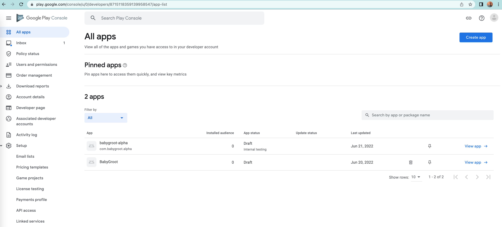
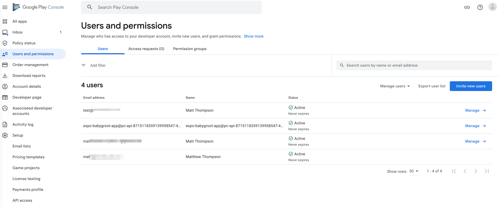
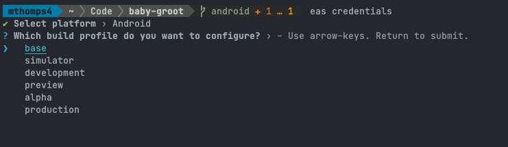
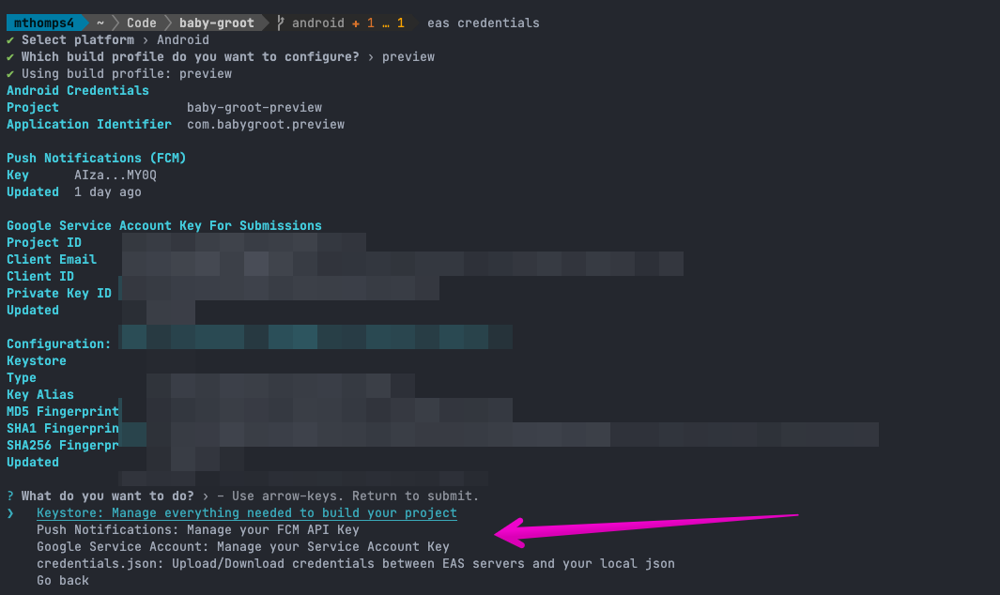
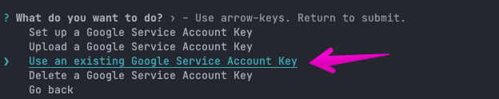
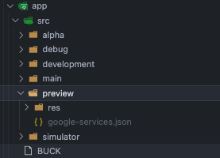
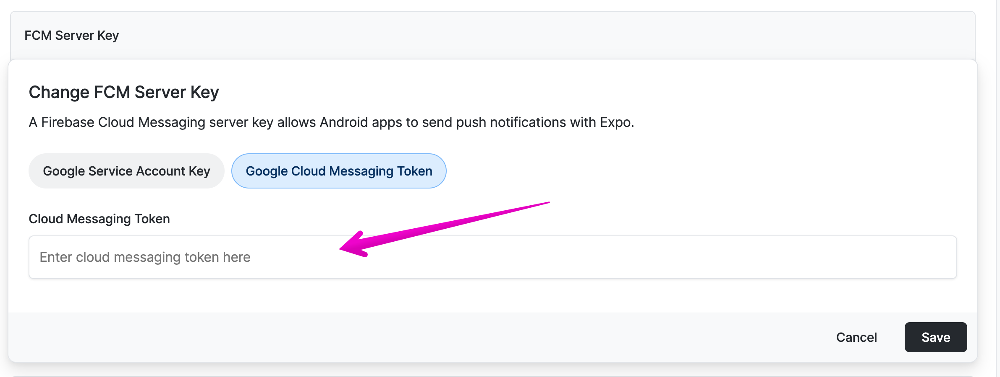

# Android Accounts and Expo Credentials

Head on over to [play.google.com/console](play.google.com/console) and create an account. Get your license ready... You'll need to fully verify yourself to fully release and Unlike apple - this is only a $25 fee to get rolling for "All the Things".

Once you have an account set you should see a dashboard like below.

## Test Users

OPTIONAL: Lets go ahead and add invite some test users for future us. (I add my personal email)
Click on `Users and Permissions`.

Click on `Invite New Users` and add who you would like, this is not adding them to an App or Release to test, but rather building your internal team to quickly find and relay later. (Other Engineers/Self)

## Generating Creds for Expo

There's a handful of credentials that Expo can hang onto for us.

- Keystore (Build Credentials): Expo can manage this for us
- FCM Server Key (Optional): We can upload a Firestore/Google API key here if we wish to manage push notifications and other Google Cloud services. (more below)
- Google Service Account Key: This is managed/uploaded by us, we upload it to Expo so that Expo can Build/Submit to Google on our behalf.

### Google Service Account Key

First, lets create that Google Service Account.

Thankfully, Expo has a nice follow along here.
<https://github.com/expo/fyi/blob/main/creating-google-service-account.md>

**!NOTE:** This service account will be for ALL of our Flavors. so name it according to our `app` not the `flavor`.

After going through these steps you should now have a `json` file.

**!!SAVE THIS!!** (1Pass, somewhere safe...)

Next we can add this json file to Expo.

### EAS Credentials

run `eas credentials` and select Android.

Assuming everything so far has worked out, you'll see a screen to choose one of our build profiles.

Lets start w/ `Preview`

You'll now see our set of options for this build Profile. If you've already set these creds, you'll see a display of that as well.

We can have Expo Manage our Keystore creds for us. Go ahead and select create for this step.

CMD/CTRL+C and close out of this prompt for now.
Lets go take a look at Expo's Dashboard.

If you navigate to your project to Credentials > Android.
You should see a bundle Identifier for `com.{myApp}.preview`

Clicking into this, you'll see that our keystore creds have been set.
If you scroll down, you'll see the options for FCM and Google Service Account Key.

---

I've found it easier to upload the GSA key through the dashboard for the first time.
Click Upload and find your `json` file and click `save`.

You should now see this key uploaded as well.

---

Now for the fun rinse and repeat exercise.
Lets travel back to our terminal and run `eas credentials`

Now if we select another Profile, we can:

- Let EAS create/manage a Keystore
- Tell EAS to use an EXISTING Service Account

- Go back... Select another profile... repeat until finished.

### The End Result

At this point, you should see all your Android Bundle Identifiers with a Keystore and a linked Google Service Account. :tada:

> NOTE: Keystore and FCM are PER flavor/profile, GSA is per Project

### Other Creds

#### Credentials File

You'll notice mention of a `credentials` file in `eas credentials`. If you select `download` this will give you a JSON file of the `Keystore` creds Expo has created for us. Likewise, if your Client/Project has already created these, you can upload via credentials file as well.

#### FCM Server Key

There are a few things to note about the FCM key Mainly, you may not need it if you are not doing push notifications through Firebase. If you are, you can follow the docs here to generate a Firebase App and `google-services.json` file.

[using FCM](https://docs.expo.dev/push-notifications/using-fcm/)

Once you have the json file. You'll note an Client > API KEY.
This can be used via `eas credentials` or in the Expo Dashboard via `FCM Token`.

If you'd rather manage these via `google-service.json` you may also choose to place these files under the `flavor` folders rather than the `root` folder. `src/flavor/google-services.json`

*Folder Option:*

NOTE: If you choose to place these in a folder, they MUST be gitignored. Meaning for this to work, you'll need to BASE64 encode and write these files via CI/Doppler or some other means during your build.

** It's much easier and recommended to simply copy the API_KEY into the Expo Creds for each Identifier/Flavor.

## Our Second Build

Its time we get back to it...
We'll need to make one more change for Expo before our next build. Lets head over and update our `app.json`. [app-config](05-app-config.md)
