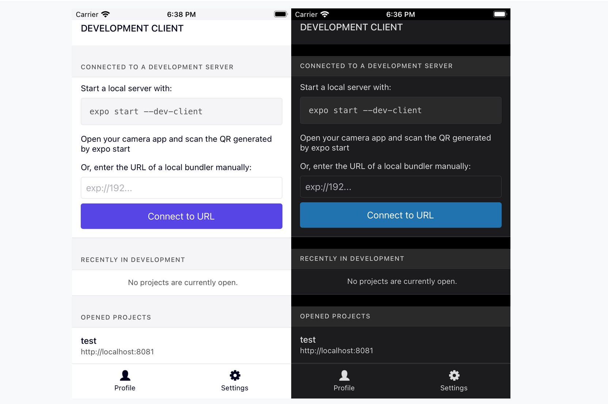
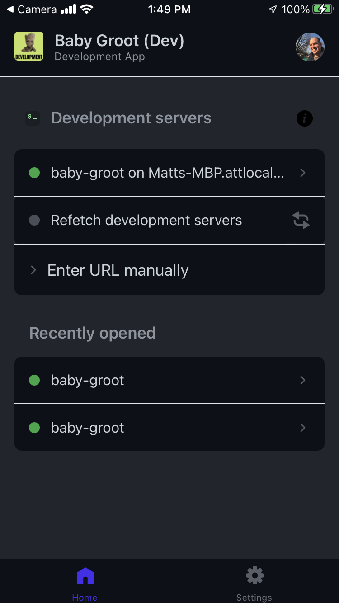
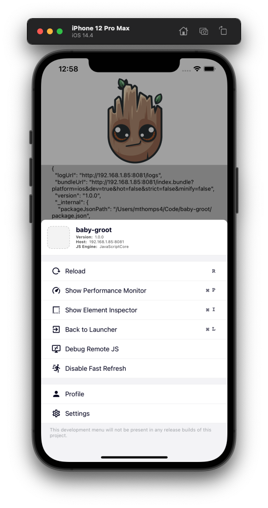

# Development Builds

So far we have our local build, Preview (Expo), and Alpha/Production in TestFlight. What happens when we want to Debug one of these builds on a real device. All of our Apps so far have been `release` builds. Where's my dev tools?!

A few small changes to our EAS, add yet another `target/flavor` and we'll be all set.

```json
// eas.json
    "development": {
      "extends": "base",
      "distribution": "internal",
      "channel": "development",
      "developmentClient": true,
      "android": {
        "gradleCommand": ":app:assembleDebug"
      },
      "ios": {
        "buildConfiguration": "Debug",
        "scheme": "babygroot-development"
      },
    },
```

The main thing to note here is that we are using `distribution: internal` and `developmentClient: true`. This tells EAS to build a release we can snag from Expo WITH the dev client. You'll note in iOS and android config we've also told EAS to build a `debug` build instead of a `release`. All these things together enable a fully functioning Dev Build.

The next thing we'll need to do is create a Developer `target/flavor` for this build. So, rinse and repeat the steps for [iOS](adding-build-variants.md#start-w-ios) and/or [Android](adding-build-variants.md#start-w-andriod) and create a `development` variant to build.

## What is the Dev Client

But what is the `developerClient`?!
[dev client intro](https://docs.expo.dev/development/introduction/)

> Development builds of your app are Debug builds containing the expo-dev-client package. Like production builds are for the general public and preview builds let your team test your next release, development builds let developers iterate as quickly as possible. They come with extensible development tools to develop and test your project.

Blah blah, heH!?

The developer client gives us a build that will look for a Metro Bundler running.
If we aren't making Native changes, you can have your Development Build installed on your phone and point the dev tools to an app (metro) running locally with `expo start --dev-client` (yarn start).



**A Working Example:**


Once you've connected to a `client` running locally, You're app will build similar to local dev. You'll see the metro bundle all the JS goodies and eventually see your app.

A few shakes or a three-finger press and you'll see our development tools are there and running as well!



**Quick Notes:**
You'll notice this is Almost the same as scanning the QR code after running `expo start --dev-client` locally.

The main difference here is that we've BUILT our Native application and installed those pieces on our device. Scanning the QR code runs everything through Expo Go.

The developer build brings us one step closer to how our application is being built and run in through the stores for troubleshooting.

## Installing

There's a few steps to getting this thing rolling
If you're rolling managed this is a simple install... but we do things bare metal around here, so buckle up for more native changes.

`expo install expo-dev-client`

[Bare Workflow Guide](https://docs.expo.dev/development/installation/)
Follow along with the **WITH EXPO MODULES** sections for both iOS and Android.

While the Diffs arent' crazy, they are tedious. If something breaks down -- slowly revert and retry walking the docs.

### Removing Start Packager

Expo's recommendation is to remove the `Start Packager` from the build process. This will allow you to Start the metro bundler yourself instead of the App attempting to do it automagic-epic-failurely.

Hop into XCode and for **ONLY** our **DEVELOPMENT TARGET** locate the Build Phases and remove `Start Packager` from the phases.

### w/ Expo Updates

So you can hot install via Expo Updates -- We haven't attempted that yet... if you want give it a go. We'll be skipping `expo update` for now.

## Simulation Builds

We've got one final trick up our sleeve. A build for our Simulator.
I've built a DevBuild for my Android but who carries two phones around?!

Simulation builds will be slightly different in the fact that the output from `eas build...` will result in a Zip file of our applications.
A `.app` for iOS and depending on config `.apk` for android.

We can take these files and Drag n Drop them to install on a simulator.

Similar to our Development build. This will bypass Expo Go and install an application on the "Device" that is looking for a running Metro Bundler.

On opening the app you'll see the Dev-Client menu in a similar fashion, point it to your locally running metro and :boom:. You have a Debug build on your simulator outside of the Expo Go world.

So how do we do that?!

### Simulator Build Variant

You guessed it! Time for another EAS tweak and yet ONE FINAL build variant (target/flavor).

```json
    "simulator": {
      "extends": "base",
      "distribution": "internal",
      "channel": "simulator",
      "developmentClient": true,
      "android": {
        "gradleCommand": ":app:assembleDebug",
        "buildType": "apk"
      },
      "ios": {
        "buildConfiguration": "Debug",
        "simulator": true,
        "scheme": "babygroot-sim"
      },
    },
```

A few things to note in this blob of JSON. We still have distribution internal, devClient is set to true, ios and android have "debug" configs, but we've added a few extra bits.
In iOS we've added `simulator: true` and for Android `buildType: apk` (Controls what Gradle task will be used and can be overwritten by the other commands).

This will tell EAS - Bundle some files instead of shipping to Expo.

Run off and create that Build Target/Flavor if you haven't already.

Now when we run `eas build --profile simulator` we'll be left with a Zip of our application builds.

Running those in our simulation should take showcase the Developer Client similar to above.

## Next Up -- ENVS w/ Doppler

[Doppler ENVs w/ Expo](./doppler-envs-w-expo.md)
