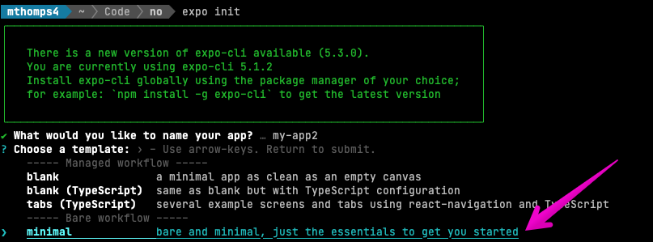

# Getting Started

## TOC

- [Getting Started](#getting-started)
  - [TOC](#toc)
  - [Sections](#sections)
  - [Requirements](#requirements)
  - [Recommended Reads](#recommended-reads)
  - [Downloads](#downloads)
  - [Setup a new Project](#setup-a-new-project)
    - [Init](#init)
    - [Add Typescript](#add-typescript)
    - [Add some Code](#add-some-code)
    - [Expo Go](#expo-go)
      - [On machine](#on-machine)
      - [On Device](#on-device)
      - [Test](#test)
  - [What's next](#whats-next)

## Sections

- [Getting Started](./getting-started.md)
- [Building Your First App](./building-your-first-app.md)
- [Adding Build Variants](./adding-build-variants.md)
  - [Adding Targets for iOS](./ios-adding-build-targets.md)
  - [TODO: Adding Android Flavors](./android-adding-flavors.md)
- [Building by Profile](./building-by-profile.md)
- [To the App Store](./to-the-app-store.md)
  - [iOS: to TestFlight](./to-test-flight.md)
  - [TODO: Android: to GooglePlay](./android-to-google-play.md)
- [Creating the Development Build](./creating-the-development-build.md)
- [Creating the Simulator Build](./creating-the-simulator-build.md)

## Requirements

- An Expo Account [signup](https://expo.dev/signup)
- An Active Apple Developer for iOS/TestFlight [developer.apple.com](https://developer.apple.com)
- An Active Google Play Store account for Android Submission [developer.android.com](https://developer.android.com/)

## Recommended Reads

- [JDK for M1s](https://discord.com/channels/370570267069513731/773706016457621545/961380144650539049)
- [Expo Glossary](https://docs.expo.dev/workflow/glossary-of-terms/)

## Downloads

- [Expo Cli](https://docs.expo.dev/workflow/expo-cli/)
`yarn add -g expo-cli`
- [EAS Cli](https://github.com/expo/eas-cli)`yarn global add eas-cli`
- [iOS Sim](https://docs.expo.dev/workflow/ios-simulator/)
- [Android Studio](https://docs.expo.dev/workflow/android-studio-emulator/)
- [Expo Go](https://expo.dev/client) (on Device)

## Setup a new Project

### Init

- To start lets create a Bare workflow with `expo init` and selecting BARE workflow. OR use the shortcut here `expo init --template bare-minimum`

### Add Typescript

- Add Typescript by following the docs here. [Expo Typescript](https://docs.expo.dev/guides/typescript/)

### Add some Code

- [Expo Bare "Hello World"](https://docs.expo.dev/bare/hello-world/)
- Test your simulator with `yarn ios|android`

### Expo Go

#### On machine

- Run `eas login`
- Authenticate with your Expo.dev account
- Confirm with `eas whoami` | `expo whoami`

#### On Device

- Log into Expo Go with the same account

#### Test

- Now when you run `yarn ios|android` you should see the app running under "Recently in Development".
- Click the app in Expo Go
- You should see the metro bundler start to build in your terminal. Once complete, you should see the app running THROUGH Expo Go on your local device. This will differ slightly from our Development build, but more on that later.

## What's next

At this point, you should have a "Hello World" application and the ability to run it in a simulator with `yarn ios|android`. If that's the case, lets dive into the fun world of building your App for deployment. [Building Your App](./building-your-first-app.md)
