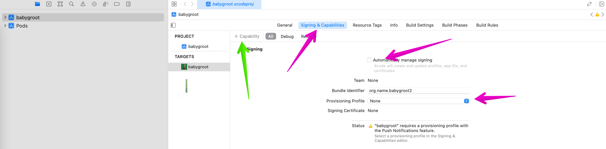
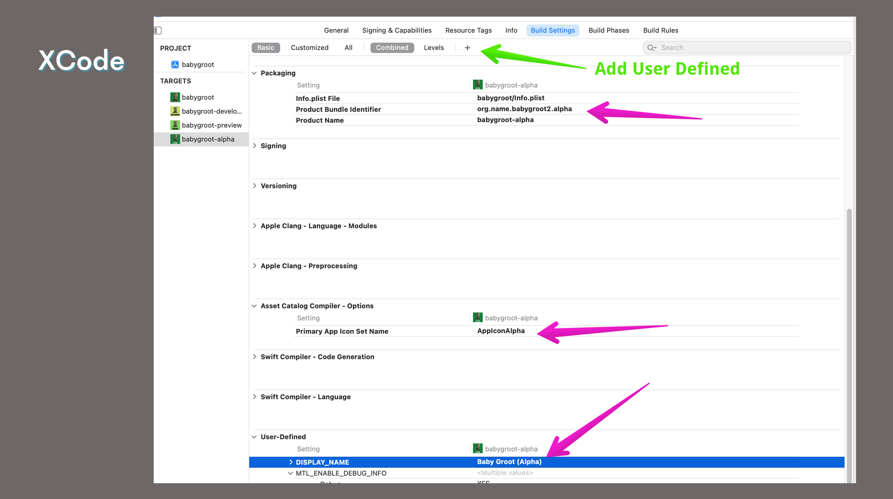
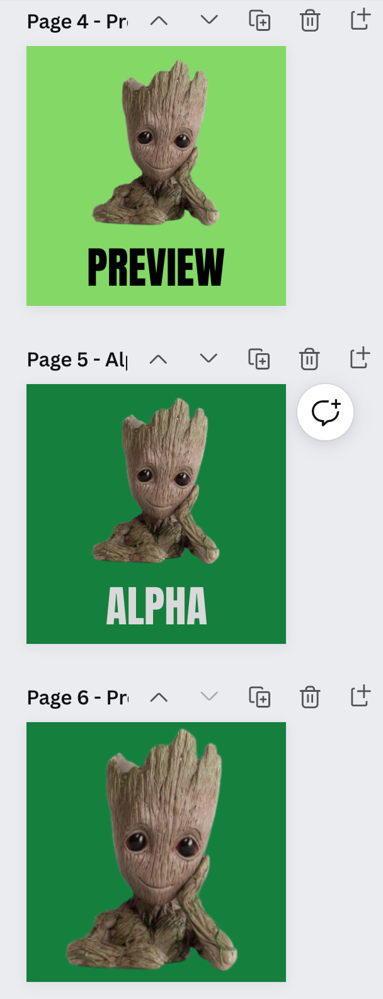
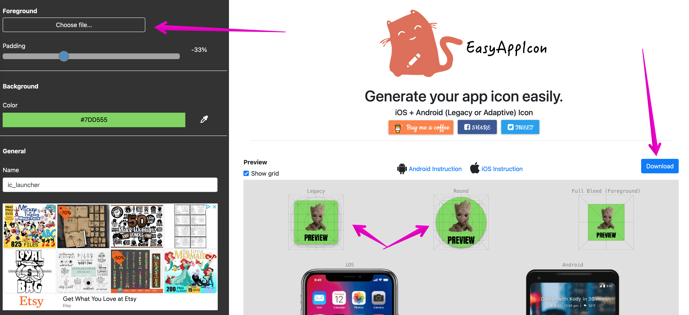
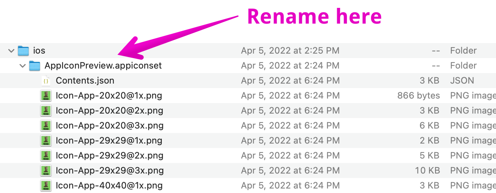
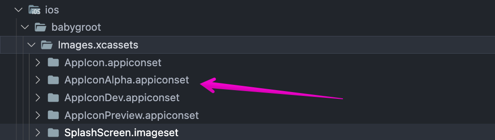

# TOC

- [TOC](#toc)
  - [Adding Build Targets in iOS](#adding-build-targets-in-ios)
    - [EAS Base Config](#eas-base-config)
    - [Target? the store?](#target-the-store)
  - [The Native Code Changes](#the-native-code-changes)
    - [Podfile](#podfile)
    - [XCode Changes](#xcode-changes)
      - [Signing and Capabilities](#signing-and-capabilities)
      - [Duplicating our Current Target](#duplicating-our-current-target)
      - [Update the Build Settings](#update-the-build-settings)
        - [Packaging Settings](#packaging-settings)
        - [Display Name](#display-name)
        - [AppIcons Target](#appicons-target)
    - [Generating App Icons for iOS](#generating-app-icons-for-ios)
  - [Building your new target](#building-your-new-target)

## Adding Build Targets in iOS

We'll be following Expos docs pretty 1:1 here. I'll try to point out a couple of "Gotcha's" along the way.

[bare-workflow ios variants](https://docs.expo.dev/build-reference/variants/#ios)

The first thing we want to update is the build section of our `eas.json`.
our original build:configure line created a `preview` profile for us, but there's some extra work to get this set.

### EAS Base Config

We'll want to create a "Base" profile that we can `extend` into our other profiles. This tells Expo which specific versions we care about when building our app. `npm`, `yarn`, `pods`, `expo sdk`, etc.

The next step we'll want to update our Preview profile to use base, as well as add a few iOS specifics. Namely: `scheme` and `buildConfiguration`.

For our preview build we want to ensure we are creating a `Release` build. This ensures the build remains slim and cuts out all the developer tools we'd normally see when testing, giving us a more realistic app experience when testing.

`scheme` is our main iOS player in eas.json for build variants. This tells Expo to build for "this target".

```json
    "base": {
      "node": "16.13.1",
      "yarn": "1.22.10",
      "android": {
        "image": "latest"
      },
      "ios": {
        "image": "latest",
        "cocoapods": "1.11.2"
      }
    },
    "preview": {
      "extends": "base",
      "distribution": "internal",
      "ios": {
        "scheme": "babygroot-preview",
        "buildConfiguration": "Release"
      }
    },
```

### Target? the store?

Backing up to our glossary, iOS uses the term `targets` when needing to create a variant builds. And `schemes` that map to those targets telling them How/What to build. While we are using `targets` for Preview, Alpha, Production. These can also be extended targets for different iOS devices. (iPads, AppleTV, etc)

Through targets, you can establish and map really anything you need for that specific target. Different dependencies, build configuration, capabilities, ... the list goes on.

In our case we need to focus on 3 main areas - Bundle Identifier, Display Name, and the AppIcon. We'll also use XCode to ensure our app has the capabilities for Push Notifications as a working example.

## The Native Code Changes

### Podfile

If you look at our Expo docs, the next step is to create these Targets in the `Podfile`. If you open this file you'll see currently we only have one target for our app. The production target. We need to change this to an `abstract_target` named anything ("shared"). This is where our Base/Shared config will live for ALL targets.

Inside of this new `abstact_target` we need to define a new `target` for `myapp-preview`. This should match our scheme noted in `eas.json`.

**NOTE: You'll notice below I have all the other profiles commented out. Until we make the native code changes for these profiles, and build out the targets, you'll get a build error. Be sure to only add the `targets` here that you have/will set in XCode (next).

```sh
abstract_target 'shared' do
  use_expo_modules!
  config = use_native_modules!

  use_react_native!(
    path: config[:reactNativePath],
    hermes_enabled: podfile_properties['expo.jsEngine'] == 'hermes'
  )

  # Uncomment to opt-in to using Flipper
  #
  # if !ENV['CI']
  #   use_flipper!('Flipper' => '0.75.1', 'Flipper-Folly' => '2.5.3', 'Flipper-RSocket' => '1.3.1')
  # end

  # TestFlight Builds
  ### PRODUCTION
  # target 'babygroot' do
  # end

  ### STAGING
  # target 'babygroot-alpha' do
  # end

  # EAS/Expo Profile Install
  ### DEV STAGING / SANITY
  target 'babygroot-preview' do
  end

  ### DEV DEBUGGER BUILD
  # target 'babygroot-development' do
  #   # Pods for dev client
  #   pod 'expo-dev-menu', path: '../node_modules/expo-dev-menu', configurations: :debug
  #   pod 'expo-dev-launcher', path: '../node_modules/expo-dev-launcher', configurations: :debug
  # end

  post_install do |installer|
  ...rest of Podfile
```

### XCode Changes

Up until now we haven't opened XCode. Now's the time.
XCode will help us update and create all the files needed for our new build target.

Open the `ios` folder in XCode.
Following the Expo Docs you should see your app, Project and the current Production target. `myApp`.

#### Signing and Capabilities

-- GOTCHA NOTE --
Before we move too far, let's ensure a couple of things not noted in Expos Docs


Click on your target in Xcode, and then navigate to `Signing and Capabilities`.
Here we want to make sure that `Auto Signing` and `Provisioning Profile` are turned OFF/to None. We don't want XCode to create any Certs or Keys for us. Expo is handling that.

We also want to add the `Push Notification` Capability to match our setup so far.

Click on `+ Capabilities` and add Push Notifications.

#### Duplicating our Current Target

Lets keep following along w/ our Expo doc.

- Duplicate the current target
- Rename the Duplicated target from `(copy)` to `-preview`
- Next update the scheme associated with that Target
  - Product -> Scheme -> Manage Schemes
  - Find the "copy" scheme
  - Rename
  - HIT ENTER!
  - UnCheck ReCheck the box
  - Go back into Product -> Scheme -> Manage Schemes
    - Double check the name change took
    - Un check and recheck for sanities sake
  - CONFIRM YOU HAVE NEW FILES TO COMMIT
  - DELETE The file `/ios/myapp copy-info.plist`

#### Update the Build Settings

Now that the Target/Scheme is set, we can navigate to `Build Settings`. This is where we will start telling our Target about the appropriate Identifiers, Name, and Icon.

Under Packaging Section

##### Packaging Settings

- Update `info.plist File` to use the original `{myApp}/Info.plist`
- Update the bundle Indentifer to be `org.name.{myApp}-preview`
  - This will allow the device to know we have a different app to be installed
- Update the name to `{myApp}-preview`

##### Display Name

This will be the name seen on the Home Screen.

- Click the "+" at the top near "levels" to add a User Defined field
- Call it `DISPLAY_NAME` and provide a name for the app. `My App (Preview)`
- In VSCode, Open `Info.plist` and add the following code snippet. This will tell the app to look for this value when building/bundling our app.

```xml
 <dict>
  <key>CFBundleDisplayName</key>
  <string>$(DISPLAY_NAME)</string>
    ... rest of file
```

##### AppIcons Target

We haven't created the AppIcons yet, but we can go ahead and tell it what folder to look for them in. By default this looks for a folder set called `AppIcon` under `ios/myApp/Images.xcassets/AppIcon.appiconset`

For Preview we'll create a new folder called `AppIconPreview.appiconset`

We simply need to update the name from `AppIcon` to `AppIconPreview` in our Build Settings.

The final result should look similar to below:



### Generating App Icons for iOS

To my knowledge there's no helper built into XCode for this like there is in Android Studio. So we venture out to the World Wide Google to solve this issue. "App Icon Generator".

I personally stumbled upon [easy app icon](https://easyappicon.com/) and found it to generate all I need for iOS. While it exports android pieces as well, I've found it straight forward enough to let Android Studio help us with that Platform specific.

**Pro Tip**: AppIcons at their largest recommend are 1024x1024. To help with this, I created a quick template in Canva to generate AppIcon pngs.



Upload the Icon, it should recognize and generate a Background Color for you, leave the export name as is. You can toggle the Zoom and note the Icons on the left to see how it will look with rounded corers, where words may chop off etc.

Once you are happy export!


Unzip the download and you should see all your files.
You'll notice the iOS folder is already named `AppIcon.appiconset`.
Go ahead and rename it here, and drag 'n drop to VSCode under `Images.xcassets`.




If you restart XCode -- you should see your new Icon show on the new Target!!

Let's test drive this thing Yo!

## Building your new target

[building by profile](./building-by-profile.md)
