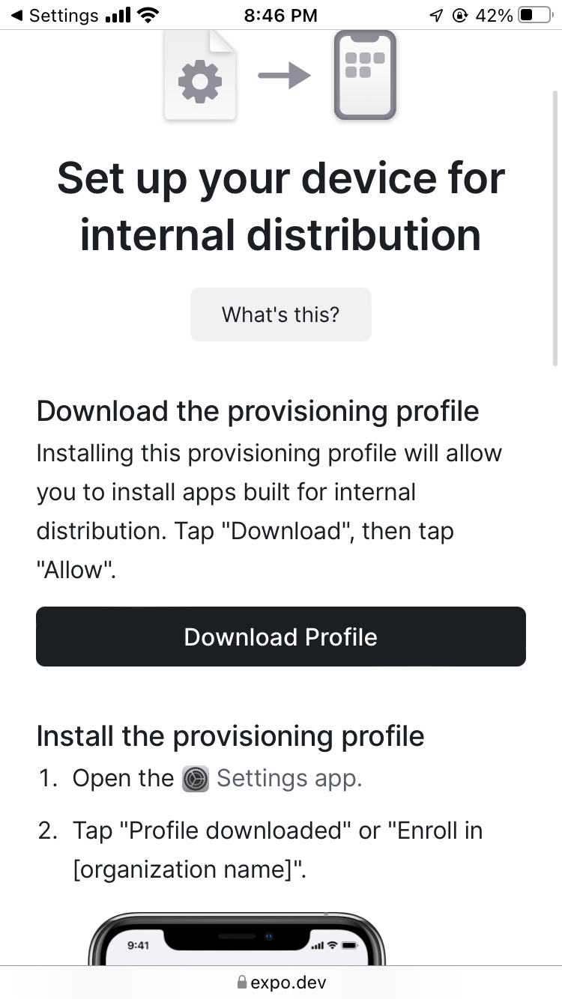
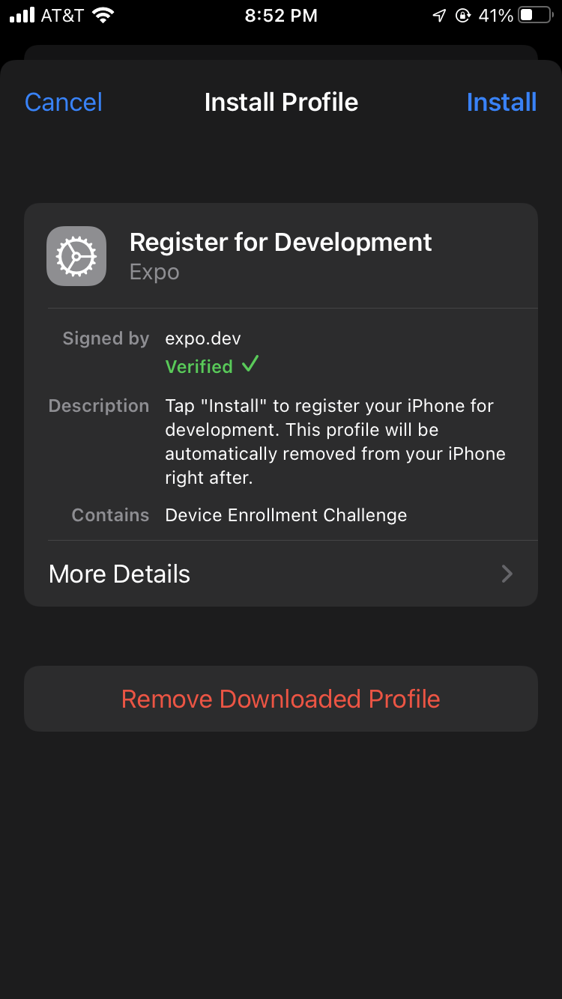
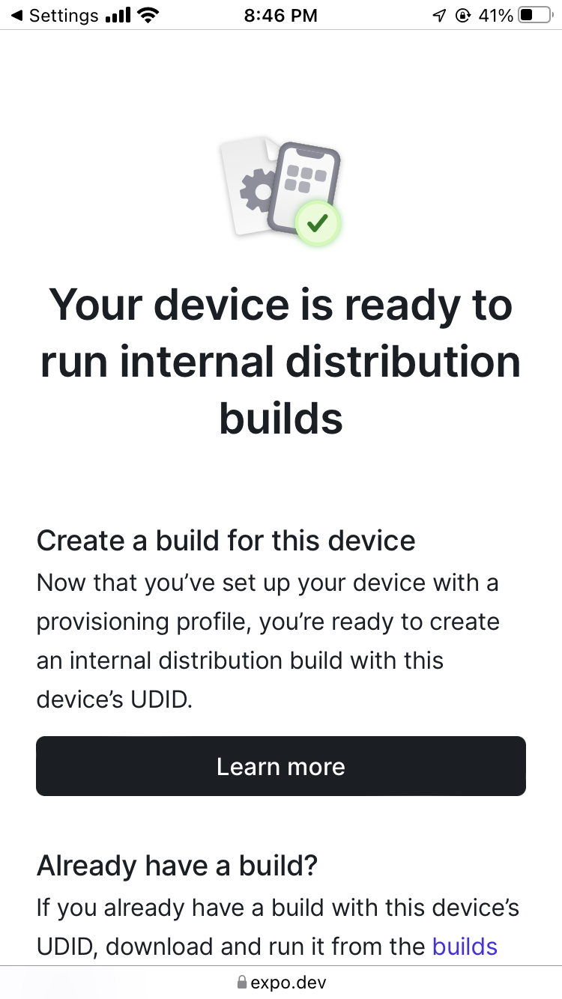

# Expo Profile (Devices)

When building with EAS you'll be asked to choose from a list of known devices.
Or if it is your first time, add a device.

For Internal builds, you'll leverage Expo's Profile API to enable downloading those builds straight from Expo.

It's unlikely you know the UUID for your device, so follow the URL given.

## IOS Example

you'll be brought to a link to "Download" the profile for Expo.

Follow the prompts and navigate to Settings.
You should see a link at the top of settings that say's something along the lines of "Install Profile"
*Click that.

Once complete you should be brought back to a Success Page.
** Take note, this page will also show your UUID.. Copy this somewhere safe just in case.

From here, you should be able to return to your build prompt in the terminal.

**Tip: If for some reason the device did not register, select the Manual UUID option.
You now have the UUID for your device and it _should_ register instantly with that.

[back to building](./building-your-first-app.md#setting-up-a-device)
