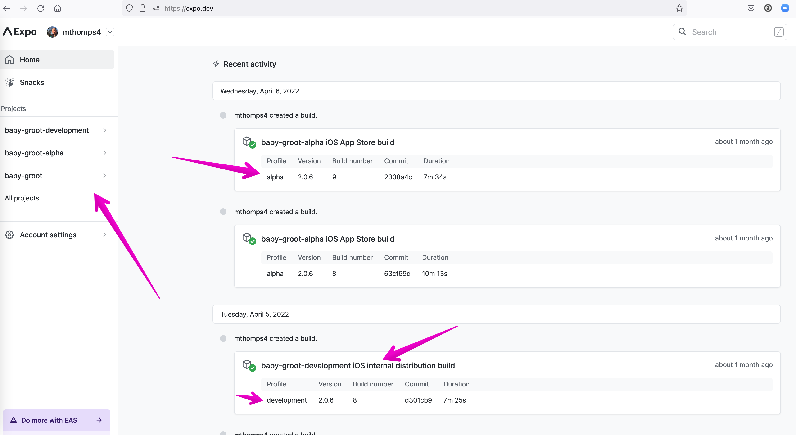

# To the App Store

## Prepping a build for TestFlight

If you recall in our Preview build profile, we set this build to be for "internal"

```json
"preview": {
  "distribution": "internal",
}
```

This works great for installing from Expo but for IOS, we need to get this to TestFlight ASAP for test user groups, feedback, and more importantly Apples approval process. This will let of know of any "Gotchas" sooner rather than later when trying to submit our app for Production. To do that we need a new Build Profile. For this example, we are going to assume we still aren't quite ready for production and want to have this app pointing to Staging credentials. We'll call this build profile `ALPHA`. This also coordinates with Androids "Tracks" for Alpha, Beta, Prod.

```json
    "build": {
      "preview": {
        // ...previous setup
      },
      "alpha": {
        "extends": "base",
        "channel": "alpha",
        "env": {
          "APP_ENV": "alpha"
        },
        "ios": {
          "scheme": "myApp-alpha",
          "buildConfiguration": "Release"
        },
      },
    }
```

Similar to before we'll add a new `scheme` for `-alpha` in our `ios` block for our future target. The main difference here is that we don't have a `distribution` key as it defaults to `"store"`.

### Rinse and Repeat

Take a look back at our notes for [adding build targets](./ios-adding-build-targets.md) for ios.
Follow all of these instructions until you have a new target `alpha` with an updated name and appIcon.
All of this should be the exact same until we go to build.

## Building for TestFlight

### Versioning

We can chat a ton about versioning... TLDR we want CI/CD to handle a good chunk of this for us.

For now we need to update the version or buildNumber before we can submit to the store.
Open the `info.plist` file and bump this number

```xml
  <key>CFBundleVersion</key>
  <string>9</string>
```

commit that and lets get building.

You have a new target set, and you're ready to build.
Similar to our preview command, run:
`eas build -p ios --profile alpha`

Again, follow the prompts and let EAS handle all the things:

- Yes Apple Creds
- Yes create a new profile
- select device(s)
- select push notification keys
- wait...
- wait...
- Hopefully Success! (If not double check all the steps for building our targets)

GOTCHA: If you are using Expo Modules remember to RE RUN the `npx` command each time you create a new target. This will ensure all the native files are updated with the knowledge of your new target.

If you have a successful build, lets go see the differences in Expo Dashboard.

---

### Expo Dashboard

If you navigate to Expo and your project within you should see your projects and recent activity.
To see a list of builds for a specific project, you can click into the names on the left.

You'll see your most recent builds as well, here you can note where we've built an internal build to download from Expo, as well as our "alpha" build for the store.



Clicking into our Store build, you'll see we have the option to SUBMIT instead of download.
Rather than click here, we're going to go ahead and submit

**Credentials**
If you click on credentials, you can also see the keys and credentials Expo has provisioned for us by target name in iOS.

## TestFlight Dashboard

Overview

### Testing Groups and Users

- compliance information
- adding users
- Internal vs External Groups

#### Compliance Information & Automating the Questionnaire

**What is compliance?** Apple asks about compliance to export laws, more info can be read [here](https://developer.apple.com/documentation/security/complying_with_encryption_export_regulations). Without adding information to the info.plist you will be prompted with a warning upon each TestFlight build that says `⚠️ Missing Compliance`. This requires answering 4 questions. If you were to answer them (with the knowledge) as `yes, no, no, no` it will suffice compliance and allow build to be available. Once you know that the app is exempt from the export reporting you can set a key in the `info.plist` that will automate the builds processing upon upload to TestFlight.

##### Automation the Questionnaire

1. Add `ITSAppUsesNonExemptEncryption` property to the `info.plist` with a value of `false`

>This looks like

``` javascript
   <key>ITSAppUsesNonExemptEncryption</key>
   <false/>
```


#### Adding users

Users are added to Internal Test Groups by being a member of the Developer Organization

External Users/Testers (Groups) can be added to builds as well. They do not need to be a part of the Apple Developer Account. When adding external users to a TestFlight build it will require

#### Internal vs. External Testers/Groups

**Internal Testers** As mentioned above Internal Testers are those that are a part of the Apple Developer account for the application

**External Testers** Any individual that you wish to have test your app in TestFlight. Groups can be made to group them in categories. i.e. QA, external beta, etc.

When using External users or groups, a build must be reviewed by Apple before it becomes available. By adding a group or user to a build it will automatically send to the reviewers and go into pending review status. Once review is complete it will be available for install or update in TestFlight.

### Using Test Flight (as a User)

- Test Flight Emails
- Downloading Test Flight
- Accepting the Invite
- Downloading our app
- Downloading updated versions

## Congrats

You have an app ready in the AppStore. Now lets take one final look at how we can Debug these builds should anything go wrong.

[Creating the Development Build](./creating-the-development-build.md)
